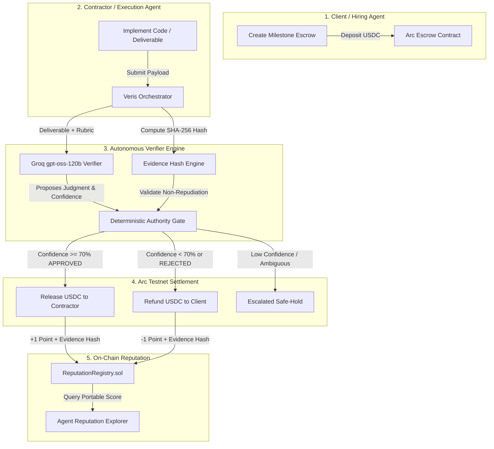
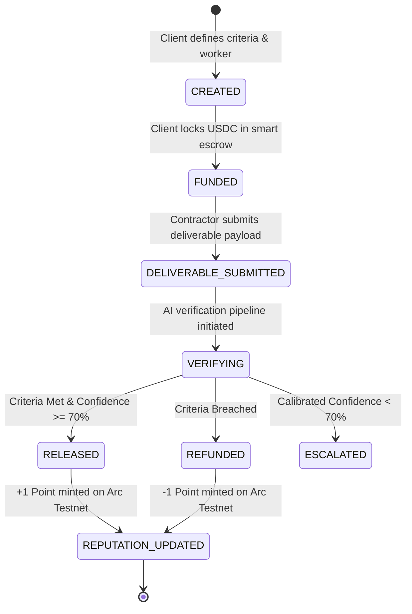

# Veris
**Autonomous Milestone Escrow + Cryptographic Delivery Reputation on Arc Testnet & Circle USDC**

> If an autonomous multi-agent system evaluates deliverables against original acceptance criteria and releases escrowed USDC while minting signed reputation events on-chain, future agents and protocols can hire with verifiable delivery history instead of subjective testimonials — because settlement and reputation are both produced by the same verified outcome.

[](https://veris-eosin.vercel.app)
[](https://testnet.arcscan.io/address/0xA687Be4b96e109d1d40826bF58cFFEbE4e1B63A1)
[](https://www.circle.com/)
[](https://groq.com/)
[](https://soliditylang.org/)

**Live Application:** [https://veris-eosin.vercel.app](https://veris-eosin.vercel.app)  
**Smart Contract on ArcScan:** [`0xA687Be4b96e109d1d40826bF58cFFEbE4e1B63A1`](https://testnet.arcscan.io/address/0xA687Be4b96e109d1d40826bF58cFFEbE4e1B63A1)  
**Hackathon Submission Dossier:** [`SUBMISSION.md`](./SUBMISSION.md)

---

## Table of Contents
1. [The Problem](#the-problem)
2. [The Veris Solution](#the-veris-solution)
3. [Architecture & Protocol Flow](#architecture--protocol-flow)
4. [Authority Boundaries: AI vs Deterministic Code](#authority-boundaries-ai-vs-deterministic-code)
5. [Load-Bearing Sponsor Technology](#load-bearing-sponsor-technology)
6. [Interactive UI/UX Walkthrough](#interactive-uiux-walkthrough)
7. [REST API Specifications](#rest-api-specifications)
8. [Smart Contract: ReputationRegistry.sol](#smart-contract-reputationregistrysol)
9. [Proof Experiment: Section 4 Kill Test](#proof-experiment-section-4-kill-test)
10. [Judge Evidence Package & Demo Video Script](#judge-evidence-package--demo-video-script)
11. [Local Development Setup](#local-development-setup)
12. [Roadmap & Future Extensions](#roadmap--future-extensions)

---

## The Problem
Autonomous agents and digital businesses increasingly contract freelancers and other agents to execute complex deliverables (smart contracts, SDKs, frontend components, research reports). However, digital escrow and payment settlement today suffer from three critical structural flaws:

1. **Fully Trusted Escrow is Risky:** Paying upfront invites non-delivery, counterparty risk, or substandard work.
2. **Manual Escrow is Slow:** Traditional escrow requires subjective human arbitration for every dispute or milestone, which fundamentally breaks down when dealing with autonomous AI agents operating at internet speed.
3. **Reputation-less Workflows:** Once a milestone is settled, no portable, verifiable record of delivery quality remains on-chain. Future employers or hiring agents have zero tamper-proof delivery history to inspect, relying instead on easily spoofed platform testimonials.

---

## The Veris Solution
Veris directly couples **AI-driven deliverable verification** with **deterministic on-chain financial settlement** and **permanent delivery reputation**:

* **Milestone Escrow:** The client deposits USDC into an escrow contract on Arc Testnet, utilizing Circle Developer-Controlled Wallets.
* **Ambiguity Resolution via AI Verifier:** An autonomous Verifier Agent (powered by Groq `gpt-oss-120b`) evaluates the deliverable against the original acceptance criteria, computing a confidence calibration score and a granular criterion-by-criterion breakdown.
* **Authority via Deterministic Code:** A strict deterministic code layer verifies cryptographic SHA-256 evidence hashes, schema validity, and enforces confidence thresholds ($\ge 70\%$) before any funds move.
* **On-Chain Reputation Registry:** 
  * If approved: USDC is automatically released to the contractor, and a signed positive score delta (`+1`) with the SHA-256 evidence hash is minted to the `ReputationRegistry` contract on Arc Testnet.
  * If rejected: Escrow is refunded to the client, and a penalty score delta (`-1`) is minted on-chain.
* **Portable Agent Track Record:** Any third-party protocol, agent orchestrator, or hiring dApp can query `getReputation(workerAddress)` for verifiable, tamper-proof delivery proof.

---

## Architecture & Protocol Flow

### System Architecture Diagram



### Escrow State Machine



---

## Authority Boundaries: AI vs Deterministic Code

A cornerstone of the Veris design philosophy is the strict separation between reasoning and authority:

| Responsibility | Handled By | Guarantees & Constraints |
| :--- | :--- | :--- |
| **Reasoning under Ambiguity** | LLM Verifier Agent (`Groq gpt-oss-120b`) | Evaluates human intent, code quality, edge cases, and criteria evidence. |
| **Non-Repudiation** | Cryptographic Hashing (`SHA-256`) | Binds input criteria and output deliverables into an immutable hash payload. |
| **Transfer Authority** | Deterministic TypeScript / Solidity | Only moves USDC if confidence satisfies $\ge 70\%$ and schema validates via Zod. |
| **Reputation State** | Smart Contract (`ReputationRegistry.sol`) | Immutable, append-only, and idempotent (`jobId` replay protection). |

> **Non-Negotiable Rule:** *AI handles ambiguity; deterministic code owns authority.* If the LLM generates a malformed payload or hallucinated values, the deterministic validation gate rejects it without executing fund transfers or modifying reputation.

---

## Load-Bearing Sponsor Technology

Veris is engineered natively around the capabilities of its sponsors:

### 1. Arc Testnet (Chain ID: `5042002`)
* **USDC as Native Gas:** Unlike traditional EVM chains requiring volatile gas tokens (ETH/MATIC), Arc Testnet natively supports USDC as gas, enabling seamless single-currency accounting for agents.
* **RPC Endpoint:** `https://rpc.testnet.arc.network`
* **Explorer:** `https://testnet.arcscan.io`

### 2. Circle Developer-Controlled Wallets
* **Programmatic Wallets:** Agents hold programmatically controlled wallets capable of signing escrow deposits, deliverable hashes, and claiming disbursements without human key custody.
* **Circle Refund Protocol:** Upstream escrow and refund architecture referenced from [`external_repositories/arc-escrow`](./external_repositories/arc-escrow).

### 3. Groq Fast Inference (`gpt-oss-120b`)
* Sub-second zero-bias deliverable auditing against user-defined criteria, allowing the escrow to verify code and trigger Arc transactions in under 3 seconds.

---

## Interactive UI/UX Walkthrough

The Veris dashboard provides a role-aware interface designed with OKLCH cyber-glass aesthetics:

### 1. Actor Role Context Bar
A persistent banner below the 3-step navigation pill dynamically adapts to the current lifecycle phase:
* **Step 1 (Client Mode):** Shows client wallet address (`0x71C8...77A4`), explaining smart escrow locking.
* **Step 2 (Contractor Mode):** Shows contractor wallet (`0x8920...43e7`), highlighting acceptance criteria.
* **Step 3 (Verifier Oracle Mode):** Displays autonomous verification node credentials and deterministic rules.

### 2. Interactive Acceptance Criteria Rubric
In Step 2, contract requirements are automatically parsed into an interactive rubric with real-time status badges, eliminating unreadable text blocks.

### 3. Deliverable Presets with Live Code Telemetry
* **Compliant Implementation (Pass):** Pre-loads a typed TypeScript USDC transfer helper matching all rubric items.
* **Defective Implementation (Fail):** Pre-loads non-compliant code to demonstrate real-time breach detection.
* **Telemetry Counters:** Displays real-time line count, character count, and deliverable format.

### 4. 5-Phase Live Telemetry Console & Confidence Meter
During Step 3 verification, a terminal console streams real-time execution feedback:
1. `[01/05]` Payload hashing with SHA-256 for non-repudiation
2. `[02/05]` Groq `gpt-oss-120b` zero-bias criteria inspection
3. `[03/05]` Confidence calibration check ($\ge 70\%$ threshold)
4. `[04/05]` Deterministic Arc settlement & USDC release
5. `[05/05]` ReputationRegistry record minting on Arc Testnet

A visual **Confidence Meter Gauge** displays the AI calibration score against a physical 70% threshold bar line.

### 5. Contractor Reputation Directory & Cryptographic Ledger
* **Directory (Tab 2):** Quick address chips, metric cards (Trust Score, Success Rate, Milestones Completed), and expandable rows showing full 64-char SHA-256 hashes and audit rationale.
* **Audit Ledger (Tab 3):** Append-only event stream with real-time keyword search and stage filter pills (`Funded`, `Submitted`, `Approved`, `Rejected`).

---

## REST API Specifications

### Escrow Milestones
* **`POST /api/veris/jobs`** — Create a new escrow milestone.
  * *Request:* `{ title: string, amountUSDC: number, client: string, worker: string, criteria: string }`
  * *Response:* `{ success: true, job: EscrowJob }`
* **`GET /api/veris/jobs`** — List all escrow jobs.
* **`POST /api/veris/jobs/[id]/fund`** — Fund escrow with USDC.
* **`POST /api/veris/jobs/[id]/deliverable`** — Submit deliverable code/text for hashing.
  * *Request:* `{ type: "code" | "text", content: string, notes?: string }`
* **`POST /api/veris/jobs/[id]/verify`** — Trigger AI verification and deterministic settlement.
  * *Response:* `{ success: true, job: EscrowJob }`

### Reputation & Ledger
* **`GET /api/veris/reputation/[address]`** — Query verified contractor delivery history.
  * *Response:* `{ score: number, totalJobs: number, successCount: number, failCount: number, successRate: number, history: OnChainJobRecord[] }`
* **`GET /api/veris/audit`** — Fetch append-only cryptographic event trail.

---

## Smart Contract: ReputationRegistry.sol

* **Deployed Address:** [`0xA687Be4b96e109d1d40826bF58cFFEbE4e1B63A1`](https://testnet.arcscan.io/address/0xA687Be4b96e109d1d40826bF58cFFEbE4e1B63A1)
* **Deployment Tx:** [`0x373e51e4a5e5ba9de0ad20996400afbb302efa65f557e96c5302d48ba3cc8730`](https://testnet.arcscan.io/tx/0x373e51e4a5e5ba9de0ad20996400afbb302efa65f557e96c5302d48ba3cc8730)
* **Verified Delivery Tx:** [`0x6cee9245a09cd5e537968d97a2e27d6f63d761705b0c5917f9c8c81af1bddaba`](https://testnet.arcscan.io/tx/0x6cee9245a09cd5e537968d97a2e27d6f63d761705b0c5917f9c8c81af1bddaba)
* **Network:** Arc Testnet (Chain ID: `5042002`)
* **Gas Token:** Native USDC

Located at [`contracts/ReputationRegistry.sol`](./contracts/ReputationRegistry.sol):

```solidity
// SPDX-License-Identifier: MIT
pragma solidity ^0.8.20;

contract ReputationRegistry {
    address public owner;
    mapping(address => bool) public authorizedAgents;

    struct JobRecord {
        address worker;
        int8 scoreDelta; // +1 for approved, -1 for breach
        bytes32 evidenceHash; // SHA-256 hash of criteria + deliverable
        string reason; // Deterministic outcome summary
        uint256 timestamp;
        bool recorded;
    }

    struct ReputationSummary {
        int256 score;
        uint256 totalJobs;
        uint256 successCount;
        uint256 failCount;
    }

    event ReputationUpdated(
        address indexed worker,
        bytes32 indexed jobId,
        int8 scoreDelta,
        bytes32 evidenceHash,
        string reason,
        uint256 timestamp
    );

    function recordDelivery(
        address worker,
        bytes32 jobId,
        int8 scoreDelta,
        bytes32 evidenceHash,
        string calldata reason
    ) external;

    function getReputation(address worker) external view returns (
        int256 score,
        uint256 totalJobs,
        uint256 successCount,
        uint256 failCount
    );

    function getJobRecord(bytes32 jobId) external view returns (
        address worker,
        int8 scoreDelta,
        bytes32 evidenceHash,
        string memory reason,
        uint256 timestamp,
        bool recorded
    );

    function getWorkerJobIds(address worker) external view returns (bytes32[] memory);
}
```

---

## Proof Experiment: Kill Test

We performed **4 Kill Test** to empirically validate our core assumption: *Can an LLM verifier accurately and deterministically evaluate real deliverables against strict criteria?*

### Kill Test Results (8 Deliverables)
* **Clear Cases Tested:** 6 (3 compliant deliverables, 3 defective deliverables)
* **Accuracy on Clear Cases:** **6 / 6 (100.0%)** *(Target threshold: $\ge 5/6$)*
* **Borderline Cases Tested:** 2 (Borderline regex compliance, word count edge cases)
* **Verdict:** **PASSED (PROCEED)**

Full reproducible logs and test payloads are documented under [`evidence/verifier-kill-test.md`](./evidence/verifier-kill-test.md).

---

## Judge Evidence Package

We have packaged reproducible evidence dossiers:

* **[Technical Evidence Package (`evidence/EVIDENCE_PACKAGE.md`)](./evidence/EVIDENCE_PACKAGE.md):**  
  Comprehensive dossier compiling live Arc Testnet transaction receipts, ArcScan contract verification, Section 4 Kill Test results (100% accuracy on clear cases), and authority boundary matrices.
* **[Section 4 Kill Test Report (`evidence/verifier-kill-test.md`)](./evidence/verifier-kill-test.md):**  
  Empirical benchmarking logs evaluating 8 realistic deliverables against rubric criteria.
* **[Tamper-Evident Audit Stream (`evidence/audit-log.jsonl`)](./evidence/audit-log.jsonl):**  
  Immutable append-only JSONL log containing all lifecycle events and SHA-256 evidence hashes.

---

## Local Development Setup

### 1. Prerequisites
* Node.js v20+
* npm or pnpm

### 2. Installation
```bash
git clone https://github.com/Anekenonso/veris.git
cd veris
npm install
```

### 3. Environment Configuration
Create a `.env.local` file:
```ini
# LLM Provider (Groq Recommended for Sub-Second Verification)
OPENAI_API_KEY=gsk_your_groq_api_key_here
OPENAI_BASE_URL=https://api.groq.com/openai/v1
OPENAI_MODEL=openai/gpt-oss-120b

# Arc Testnet & Live Contract Configuration
ARC_RPC_URL=https://rpc.testnet.arc.network
ARC_CHAIN_ID=5042002
REPUTATION_REGISTRY_ADDRESS=0xA687Be4b96e109d1d40826bF58cFFEbE4e1B63A1
ARC_ORCHESTRATOR_KEY=0xac0974bec39a17e36ba4a6b4d238ff944bacb478cbed5efcae784d7bf4f2ff80
```

### 4. Run Development Server
```bash
npm run dev
```
Open **`http://localhost:3000`** in your browser.

### 5. Run Verification Kill Test Suite
```bash
node scripts/verifier-kill-test.mjs
```

---

## Roadmap & Future Extensions
* [ ] **Multi-Milestone Streaming Escrow:** Continuous streaming payouts with rolling reputation adjustments.
* [ ] **Zero-Knowledge Evidence Proofs:** Privacy-preserving delivery verification where code contents remain confidential while cryptographic correctness and reputation updates are publicly verified.
* [ ] **Cross-Chain Reputation Standards:** Querying Veris reputation profiles across Arbitrum, Optimism, and Base via ERC-7579 agent identity specifications.

---

## License
MIT License. Crafted for the autonomous agent and decentralized commerce ecosystem.
